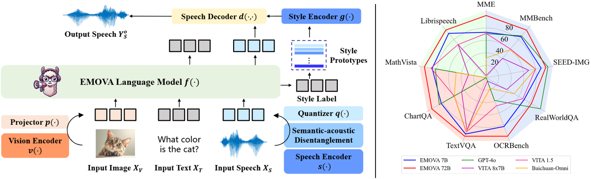
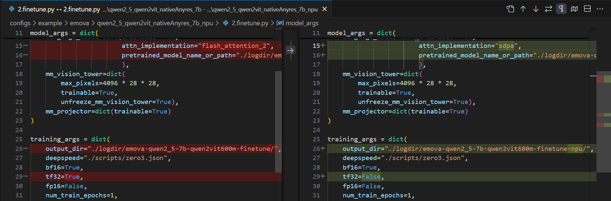

<div align="center">

</img>

# EMOVA: Empowering Language Models to See, Hear and Speak with Vivid Emotions

🤗 [EMOVA-Models](https://huggingface.co/collections/Emova-ollm/emova-models-67779d377bb8261e6057a320) | 🤗 [EMOVA-Datasets](https://huggingface.co/collections/Emova-ollm/emova-datasets-67779be7d02447a2d0891bf6) | 🤗 [EMOVA-Demo](https://huggingface.co/spaces/Emova-ollm/EMOVA-demo) <br/>
📄 [Paper](https://arxiv.org/abs/2409.18042) | 🌐 [Project-Page](https://emova-ollm.github.io/) | 💻 [Github](https://github.com/emova-ollm/EMOVA) | 💻 [EMOVA-Speech-Tokenizer-Github](https://github.com/emova-ollm/EMOVA_speech_tokenizer)

</div>

[](https://emova-ollm.github.io/static/images/video_demo_compressed.mp4)


## Introduction

**EMOVA** (**EM**otionally **O**mni-present **V**oice **A**ssistant) is a novel end-to-end omni-modal LLM that can see, hear and speak without relying on external models. Given the omni-modal (i.e., textual, visual and speech) inputs, EMOVA can generate both textual and speech responses with vivid emotional controls by utilizing the speech decoder together with a style controller. EMOVA possesses general omni-modal understanding and generation capabilities, featuring its superiority in advanced vision-language understanding, emotional spoken dialogue, and spoken dialogue with structural data understanding. We summarize its key advantages as:

- **State-of-the-art omni-modality performance**: EMOVA achieves state-of-the-art comparable results on both **vision-language** and **speech** benchmarks simultaneously. Our best performing model, **EMOVA-72B**, even surpasses commercial models including GPT-4o and Gemini Pro 1.5.
- **Emotional spoken dialogue**:  A **semantic-acoustic disentangled** speech tokenizer and a lightweight **style control** module are adopted for seamless omni-modal alignment and diverse speech style controllability. EMOVA supports **bilingual (Chinese and English)** spoken dialogue with **24 speech style** controls (i.e., 2 speakers, 3 pitches and 4 emotions). 
- **Diverse configurations**: We open-source 3 configurations, **EMOVA-3B/7B/72B**, to support omni-modal usage under different computational budgets. Check our [Model Zoo](#model-zoo) and find the best fit model for your computational devices! As far as we know, **EMOVA-72B** is the **very first** open-sourced ~70B-level Omni-modal LLM available!

<div align="center">
  </img>
</div>


## ✨ Highlights

This repo contains the full implementation of our EMOVA models. The key highlights include:

- **Fully open-source**: we release all the materials when constructing EMOVA, including the pre-trained EMOVA **checkpoints**, the training/inference/evaluation **code** and the training/evaluation **datasets**!

- **Computational device**: our codebase supports training/inference on both **NVIDIA GPUs** (e.g., A800 & H20) and **Ascend NPUs** (e.g., 910B3)!

- **Modular code architecture**: to better compare among different MLLM implementations, our codebase adopts a modular architecture, and can be separated into the three independent components: *vision encoder*, *vision projector*, and *language model*. 

  Currently, we support the following methods:
  
  

<table width="100%">
  <tbody>
    <tr align="center" valign="bottom">
      <td>
        <b>Vision Encoder</b>
      </td>
      <td>
        <b>Vision Projector</b>
      </td>
      <td>
        <b>Language Model</b>
      </td>
    </tr>
    <tr valign="top">
      <td>
        <ul>
            <li><a href="./configs/example/llava/llama3_1_clip">CLIP</a></li>
            <li><a href="./configs/_base_/models/llama3_1_siglip_anyres.py">SigLip</a></li>
            <li><a href="./configs/example/emova/llama3_1_unit_anyres">UNIT</a></li>
            <li><a href="./configs/example/emova/llama3_1_internvit_anyres_8b">InternViT-300M/6B</a></li>
            <li><a href="./configs/example/emova/qwen2_5_qwen2vit_nativeAnyres_7b">Qwen2ViT-600M</a></li>
        </ul>
      </td>
      <td>
        <ul>
          <li><a href="./configs/example/emova/qwen2_5_qwen2vit_nativeAnyres_7b">MLP</a></li>
          <li><a href="./configs/example/emova/llama3_1_internvit_anyres_8b">C-Abstractor</a></li>
          <li><a href="./configs/example/llava_next/llama3_1_internvit300m_selfMining">Self-mining-resampler</a></li>
        </ul>
      </td>
      <td>
        <ul>
          <li><a href="./configs/example/emova/qwen2_5_qwen2vit_nativeAnyres_7b">Qwen-2.5-3B/7B/72B-Instruct</a></li>
          <li><a href="./configs/example/emova/llama3_1_internvit_anyres_8b">LLaMA-3.1-8B/70B-Instruct</a></li>
          <li><a href="./configs/example/emova/deepseekv2_tiny_qwen2vit">DeepSeekMoE-tiny</a></li>
          <li><a href="./emova/model/language_model/emova_glm4.py">GLM-4-9B</a></li>
          <li><a href="./emova/model/language_model/emova_phi3.py">Phi3</a></li>
        </ul>
      </td>
    </tr>
  </tbody>
</table>
 

## 🚀 News

- **[2025-03-14]** 🔥 We support the latest **DeepSeekMoE LLMs**!
- **[2025-03-14]** 🔥 We have released EMOVA's **code** (training & inference), **datasets** (training & evaluation), and **checkpoints** (EMOVA-3B/7B/72B)!
- **[2025-02-27]** Our [EMOVA paper](https://arxiv.org/abs/2409.18042) has been accepted by CVPR 2025!


## TODO

- [ ] Integrate EMOVA into official `transformers` and `lmms-eval` repositories


## Performance


| Benchmarks         | EMOVA-3B | EMOVA-7B | EMOVA-72B | GPT-4o | VITA 8x7B | VITA 1.5 | Baichuan-Omni |
|:------------------:|:-------: |:--------:|:---------:|:------:|:---------:|:--------:|:-------------:|
| **MME**            | 2175     | 2317     | 2402      | 2310   | 2097      | 2311     | 2187           |
| **MMBench**        | 79.2     | 83.0     | 86.4      | 83.4   | 71.8      | 76.6     | 76.2           |
| **SEED-Image**     | 74.9     | 75.5     | 76.6      | 77.1   | 72.6      | 74.2     | 74.1           |
| **MM-Vet**         | 57.3     | 59.4     | 64.8      | -      | 41.6      | 51.1     | 65.4           |
| **RealWorldQA**    | 62.6     | 67.5     | 71.0      | 75.4   | 59.0      | 66.8     | 62.6           |
| **TextVQA**        | 77.2     | 78.0     | 81.4      | -      | 71.8      | 74.9     | 74.3           |
| **ChartQA**        | 81.5     | 84.9     | 88.7      | 85.7   | 76.6      | 79.6     | 79.6           |
| **DocVQA**         | 93.5     | 94.2     | 95.9      | 92.8   | -         | -        | -              |
| **InfoVQA**        | 71.2     | 75.1     | 83.2      | -      | -         | -        | -              |
| **OCRBench**       | 803      | 814      | 843       | 736    | 678       | 752      | 700            |
| **ScienceQA-Img**  | 92.7     | 96.4     | 98.2      | -      | -         | -        | -              |
| **AI2D**           | 78.6     | 81.7     | 85.8      | 84.6   | 73.1      | 79.3     | -              |
| **MathVista**      | 62.6     | 65.5     | 69.9      | 63.8   | 44.9      | 66.2     | 51.9           |
| **Mathverse**      | 31.4     | 40.9     | 50.0      | -      | -         | -        | -              |
| **Librispeech (WER↓)** | 5.4  | 4.1      | 2.9       | -      | 3.4       | 8.1      | -              |


## Contents

- [Introduction](#introduction)
- [Installation](#installation)
- [Model Zoo](#model-zoo)
- [Quick Start](#quick-start)
- [Training EMOVA](#training-emova)
- [Fine-tuning EMOVA](#fine-tuning-emova)
- [Evaluation](#evaluation)
- [Citation](#citation)
- [Acknowledgement](#acknowledgement)


## Installation

Clone this repo and create the EMOVA virtual environment with conda. Our code has been validated on **NVIDIA A800/H20 GPU & Ascend 910B3 NPU** servers. Other devices might be available as well.

1. Initialize the conda environment:

   ```bash
   git clone https://github.com/emova-ollm/EMOVA.git # main repo
   git clone https://github.com/emova-ollm/EMOVA_speech_tokenizer.git # speech tokenizer
   conda create -n emova python=3.10 -y
   conda activate emova
   ```

2. Install the required packages (note that instructions are different from GPUs and NPUs):

   ```bash
   export CUR_DIR=$(pwd)

   # upgrade pip and setuptools if necessary
   pip install -U pip setuptools
   
   # install packages for EMOVA
   cd $CUR_DIR/EMOVA
   pip install -e . 		# for NVIDIA GPUs (e.g., A800 and H20)
   pip install -e ".[npu]"	# OR for Ascend NPUS (e.g., 910B3)
   
   # install packages for EMOVA speech tokenizer
   cd $CUR_DIR/EMOVA_speech_tokenizer
   pip install -e . 		# for NVIDIA GPUs (e.g., A800 and H20)
   pip install -e ".[npu]"	# OR for Ascend NPUS (e.g., 910B3)
   
   # (GPU only) install flash attention for better effiency
   pip install flash-attn --no-build-isolation
   ```


## Model Zoo

| Model Name | Vision Encoder | LLM          | Context Length | 🤗 HF Format | Origin Format | Config                                                       |
| :--------: | :------------: | :----------: | :------------: | :---------:   | :----------: | :----------------------------------------------------------: |
| EMOVA-3B   | [Qwen2ViT-600M](https://huggingface.co/Emova-ollm/qwen2vit600m) | [Qwen-2.5-3B-Instruct](https://huggingface.co/Qwen/Qwen2.5-3B-Instruct) | 8192           |      [[link]](https://huggingface.co/Emova-ollm/emova-qwen-2-5-3b-hf)         |       [[link]](https://huggingface.co/Emova-ollm/emova-qwen-2-5-3b)       | [[link]](./configs/example/emova/qwen2_5_qwen2vit_nativeAnyres_3b/2.finetune.py) |
| EMOVA-7B   |  [Qwen2ViT-600M](https://huggingface.co/Emova-ollm/qwen2vit600m)  | [Qwen-2.5-7B-Instruct](https://huggingface.co/Qwen/Qwen2.5-7B-Instruct) | 8192           |      [[link]](https://huggingface.co/Emova-ollm/emova-qwen-2-5-7b-hf)         |      [[link]](https://huggingface.co/Emova-ollm/emova-qwen-2-5-7b)        | [[link]](./configs/example/emova/qwen2_5_qwen2vit_nativeAnyres_7b/2.finetune.py) |
| EMOVA-72B  | [Qwen2ViT-600M](https://huggingface.co/Emova-ollm/qwen2vit600m)   | [Qwen-2.5-72B-Instruct](https://huggingface.co/Qwen/Qwen2.5-72B-Instruct) | 8192           |       [[link]](https://huggingface.co/Emova-ollm/emova-qwen-2-5-72b-hf)        |      [[link]](https://huggingface.co/Emova-ollm/emova-qwen-2-5-72b)        | [[link]](./configs/example/emova/qwen2_5_qwen2vit_nativeAnyres_72b/2.finetune.py) |

- **🤗 HF Format** and **Origin Format** checkpoints share the same parameters but are organized in different formats.
- **🤗 HF Format** checkpoints should be loaded by the HuggingFace [transformers Auto Classes](https://huggingface.co/docs/transformers/model_doc/auto) APIs, which are used in the [simple inference example](#-simple-inference-example-with-huggingface) below.
- **Origin Format** checkpoints should be loaded by our `emova codebase in this repo`, which are used in the [gradio web demo](#gradio-web-demo) and [Evaluation](#evaluation) sections. Note that each **Origin Format** checkpoint is paired with the **config** file in the same row.


## Quick Start

### 🤗 Simple Inference Example with HuggingFace

> [!NOTE]  
> Here we should use the `🤗 HF Format` checkpoints in [Model Zoo](#model-zoo).

```python
from transformers import AutoModel, AutoProcessor
from PIL import Image
import torch

### Uncomment if you want to use Ascend NPUs
# import torch_npu
# from torch_npu.contrib import transfer_to_npu

# prepare models and processors
model = AutoModel.from_pretrained(
    "Emova-ollm/emova-qwen-2-5-7b-hf",
    torch_dtype=torch.bfloat16,
    attn_implementation='flash_attention_2', # OR 'sdpa' for NPUs
    low_cpu_mem_usage=True,
    trust_remote_code=True).eval().cuda()
processor = AutoProcessor.from_pretrained("Emova-ollm/emova-qwen-2-5-7b-hf", trust_remote_code=True)

# only necessary for spoken dialogue
# Note to inference with speech inputs/outputs, **emova_speech_tokenizer** is still a necessary dependency (https://huggingface.co/Emova-ollm/emova_speech_tokenizer_hf#installation).
speeck_tokenizer = AutoModel.from_pretrained("Emova-ollm/emova_speech_tokenizer_hf", torch_dtype=torch.float32, trust_remote_code=True).eval().cuda()
processor.set_speech_tokenizer(speeck_tokenizer)

# Example 1: image-text
inputs = dict(
    text=[
        {"role": "system", "content": [{"type": "text", "text": "You are a helpful assistant."}]},
        {"role": "user", "content": [{"type": "image"}, {"type": "text", "text": "What's shown in this image?"}]},
        {"role": "assistant", "content": [{"type": "text", "text": "This image shows a red stop sign."}]},
        {"role": "user", "content": [{"type": "text", "text": "Describe the image in more details."}]},
    ],
    images=Image.open('path/to/image')
)

# Example 2: text-audio
inputs = dict(
    text=[{"role": "system", "content": [{"type": "text", "text": "You are a helpful assistant."}]}],
    audios='path/to/audio'
)

# Example 3: image-text-audio
inputs = dict(
    text=[{"role": "system", "content": [{"type": "text", "text": "You are a helpful assistant."}]}],
    images=Image.open('path/to/image'),
    audios='path/to/audio'
)

# run processors
has_speech = 'audios' in inputs.keys()
inputs = processor(**inputs, return_tensors="pt")
inputs = inputs.to(model.device)

# prepare generation arguments
gen_kwargs = {"max_new_tokens": 4096, "do_sample": False} # add if necessary
speech_kwargs = {"speaker": "female", "output_wav_prefix": "output"} if has_speech else {}

# run generation
# for speech outputs, we will return the saved wav paths (c.f., output_wav_prefix)
with torch.no_grad():
    outputs = model.generate(**inputs, **gen_kwargs)
    outputs = outputs[:, inputs['input_ids'].shape[1]:]
    print(processor.batch_decode(outputs, skip_special_tokens=True, **speech_kwargs))
```


### Gradio Web Demo

To launch a Gradio web demo locally, we follow the [Controller-UI Server-Model Worker](https://github.com/haotian-liu/LLaVA?tab=readme-ov-file#gradio-web-ui) adopted by LLaVA. 

0. Install additional packages for Gradio. Note that the requirements are slightly different from the training and inference environments of EMOVA. Check the [pyproject.toml](./pyproject.toml#L37) file for more details.

   ```bash
   pip install -e ".[gradio]"
   ```

1. Launch a controller. The controller is process responsible for exchanging messages between the Gradio UI server and the model worker.

   ```bash
   python -m emova.serve.controller --host 0.0.0.0 --port 10000
   ```

2. Launch a Gradio Web UI server.

   ```bash
   python -m emova.serve.gradio_web_server --controller http://localhost:10000 --model-list-mode reload
   ```

3. Launch a model worker. Since the model workers are independent with the Gradio process, we can launch multiple model workers as long as they have different `ports` numbers but the same `controller` address. 
   > [!NOTE]  
   > Here we should use the `Origin Format` checkpoints in [Model Zoo](#model-zoo).


   ```bash
   # By default, we will extract the model path from the config files.
   # The **--model-path** argument can override the model path saved in the config files.
   python -m emova.serve.model_worker --host 0.0.0.0 --controller http://localhost:10000 --port 40000 --worker http://localhost:40000 --config /path/to/config1 --model-path /path/to/model1 --use-flash-attn
   
   # Multiple model workers are possible by changing the port numbers
   python -m emova.serve.model_worker --host 0.0.0.0 --controller http://localhost:10000 --port 40001 --worker http://localhost:40001 --config /path/to/config2 --model-path /path/to/model2 --use-flash-attn
   ```

4. Enjoy playing with EMOVA! You can also check our [interactive demo video](https://emova-ollm.github.io/static/images/video_demo_compressed.mp4) and [online HuggingFace demo](https://huggingface.co/spaces/Emova-ollm/EMOVA-demo) to learn more usages!


## Training EMOVA

### Prepare Dataset

Check the [Data](./assets/docs/Data.md#emova-training-datasets) document for more details.


### Insert Speech Tokens into LLM Vocabulary

EMOVA adopts a discrete [speech tokenizer](https://github.com/emova-ollm/EMOVA_speech_tokenizer) by discretizing speech signals into discrete tokens, which are then considered similarly with normal textual tokens to enable seamless modality alignment. Therefore, before training, we need to insert the speech tokens into the LLM vocabulary.

```bash
# By default, the vocabulary size of EMOVA speech tokenizer is 4096
python scripts/insert_speech_token.py --origin_model_path Qwen/Qwen2.5-7B-Instruct --saved_model_path ./Qwen2.5-7B-Instruct_add_speech_token_4096_nostrip --num_speech_tokens 4096
```


### Launch distributed training

We use the [task configs](./emova/registry_utils.py#L76) to manage training tasks, which typically consist of three parts: 
- **data_args**: arguments for data processing.
- **model_args**: arguments for model configuration.
- **training_args**: arguments for the training procesure.

We provide abundant [example configs](./configs/example), which we recommend users to carefully check and understand. We can use the following scripts to launch distributed training on a 8-device machine (e.g., A800/H20/910B3):

```bash
config=/path/to/config/file

# both deepspeed zero2 and zero3 are supported by setting in the config files
torchrun --nproc_per_node 8 --master_port 54222 emova/train/train.py $config

# configs can also be temporally overridden via command lines if necessary
torchrun --nproc_per_node 8 --master_port 54222 emova/train/train.py $config \
  --training_args.per_device_train_batch_size=2 \
  --training_args.learning_rate=2e-6
```

To replicate a EMOVA omni-modal LLM, a three-stage training paradigm is necessary, including *1) vision-language pre-alignment*, *2) omni-modal text-centric alignment*, and *3) omni-modal instruction tuning*. A typical example is shown as below, and we refer readers to check [here](./configs/example/emova/qwen2_5_qwen2vit_nativeAnyres_7b) for more details.

```bash
# Stage 1: Vision-language pre-alignment
torchrun --nproc_per_node 8 --master_port 54222 emova/train/train.py configs/example/emova/qwen2_5_qwen2vit_nativeAnyres_7b/0.pretrain.py

# Stage 2: Omni-modal text-centric alignment
torchrun --nproc_per_node 8 --master_port 54222 emova/train/train.py configs/example/emova/qwen2_5_qwen2vit_nativeAnyres_7b/1.alignment.py

# Stage 3: Omni-modal instruction tuning
torchrun --nproc_per_node 8 --master_port 54222 emova/train/train.py configs/example/emova/qwen2_5_qwen2vit_nativeAnyres_7b/2.finetune.py
```

### Train with Ascend NPUs

The example configs to replicate a EMOVA-7B model with Ascend NPUs (e.g., 910B3) are provided [here](./configs/example/emova/qwen2_5_qwen2vit_nativeAnyres_7b_npu). Typically, to convert a GPU task config to NPU ones, we need make the following modifications:

- **attn_implementation**: for FlashAttention, we support both **sdpa** and **flash_attention_2** for GPUs, while only **sdpa** is workable on NPUs. BTW, both GPUs and NPUs support **eager**.

- **tf32**: is not supported on NPUs.




## Fine-tuning EMOVA

To fine-tune pre-trained EMOVA model on custom datasets, we need to:

1. Organize custom data in the desired JSON format and create a new dataset config (e.g., configs/_base_/datasets/ custom_dataset.py). Detailed instructions are provided [here](./assets/docs/Data.md#custom-datasets).

2. Prepare the fine-tuning task configs. An example to fine-tune a pre-trained [EMOVA-7B](https://huggingface.co/Emova-ollm/emova-qwen-2-5-7b) is provided [here](./configs/example/finetune/qwen2_5_qwen2vit_nativeAnyres_7b).

3. We support both fully and LoRA fine-tuning.

4. Note that here we need to use the `Origin Formatted` checkpoints.

5. Finally, launch distributed training similarly with [Launch distributed training](#launch-distributed-training).

## Evaluation

Check the [Evaluation](./emova/eval/readme.md) document for more details.


## Citation

If you find our model/code/paper helpful, please consider citing our papers and staring us!

```bibtex
@article{chen2024emova,
  title={Emova: Empowering language models to see, hear and speak with vivid emotions},
  author={Chen, Kai and Gou, Yunhao and Huang, Runhui and Liu, Zhili and Tan, Daxin and Xu, Jing and Wang, Chunwei and Zhu, Yi and Zeng, Yihan and Yang, Kuo and others},
  journal={arXiv preprint arXiv:2409.18042},
  year={2024}
}
```


## Acknowledgement

We adopt the following open-sourced projects:

- [LLaVA](https://github.com/haotian-liu/LLaVA): basic codebase to conduct visual instruction tuning.
- [lmms-eval](https://github.com/EvolvingLMMs-Lab/lmms-eval): evaluation tools for vision-language benchmarks.
